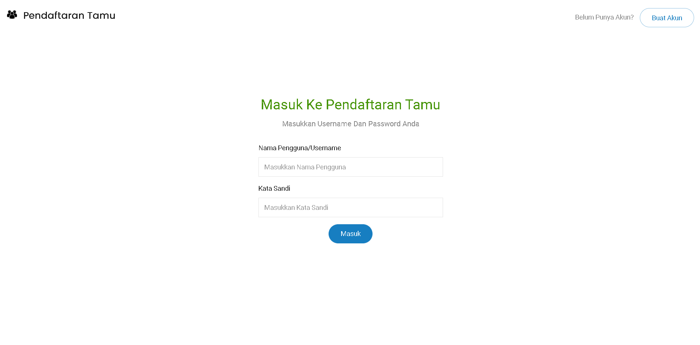
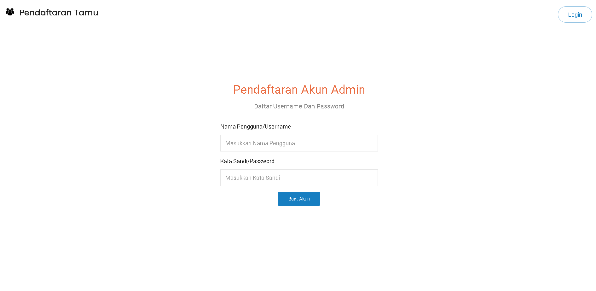
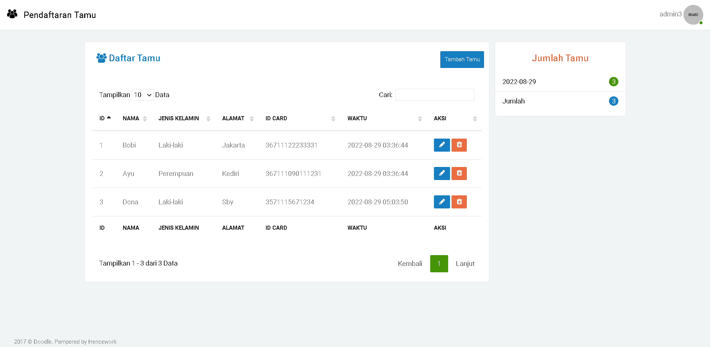
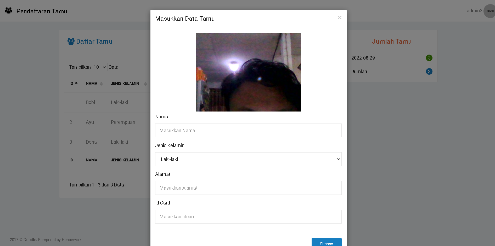
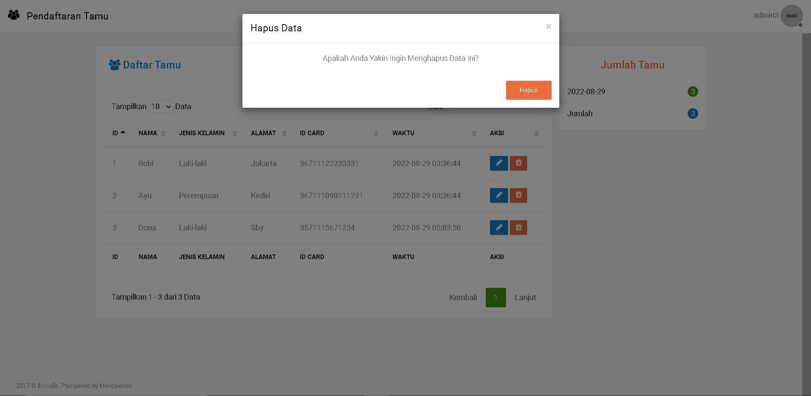
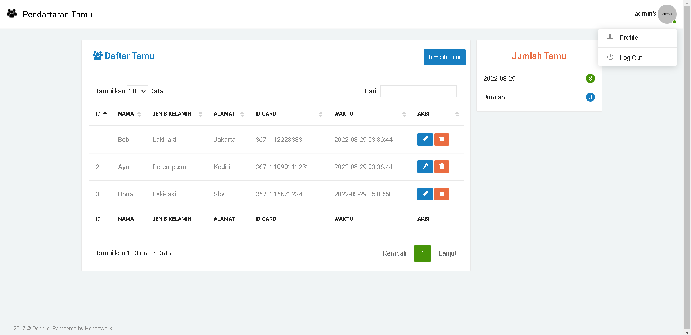

<h1 align="center">
    Aplikasi Pendaftaran Tamu
</h1>

    Fitur Aplikasi

- Admin menambahkan, mengedit, delete data tamu (CRUD)
- Admin Daftar dan Admin Login dan Admin Logout
- Filter, search, Pagination data tamu
- Memfoto Tamu (Belum sempat mengimplementasi, tetapi camera/webcam sudah bisa jalan)

Fitur aplikasi yang difikirkan tetapi belum terimplementasi :
- Scan QR Code
- Memberi uang melalui Gopay, Ovo, Dsb ( Pendaftaran Tamu untuk event Weeding)
- Push Notification ke nomor hp Tamu untuk remainder acara
- dan lain lain

## Akun :
- Username : admin3
- password : admin3

# Demo Aplikasi :

<h3>1. Admin Login</h3>

<h3>2. Signup Admin</h3>

<h3>3. Dashboard Pendaftaran Tamu</h3>

<h3>4. Tambah/Pendaftaran Tamu</h3>

<h3>5. Edit Data Tamu</h3>

<h3>6. Hapus Data Tamu</h3>

<h3>7. Logout</h3>

## Cara Instalasi

- Clone atau download repo ini
- Jika clone, maka buat folder di dalam htdocs xampp. Jika download, extract zip di dalam htdocs
- Masukkan file .sql ke dalam phpmyadmin anda
- Setting config.php pada base_url, sesuaikan dengan alamat folder url anda
- Lalu pada database.php, sesuaikan hostname, username, password, database
- Lalu buka url yang tadi sudah di setting yaitu pada config.php base_url
- Aplikasi sudah bisa berjalan

## Aplikasi ini dibuat dengan :
- PHP ^7.4
- Codeigniter 3
- Jquery
